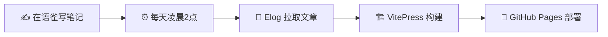

# 🎛️ 博客管理控制台

## 📊 系统状态

| 项目 | 状态 |
|------|------|
| 语雀同步 | ✅ 正常（每天凌晨 2 点自动同步） |
| GitHub Pages | ✅ 正常 |
| 文章总数 | **41 篇**（13 章 Python 教程） |
| 上线时间 | 2026-06-28 |

## ⚡ 快捷操作

| 操作 | 按钮 |
|------|------|
| 手动触发同步 | [👉 去 GitHub Actions](https://github.com/Yixi233-mo/python-notes/actions/workflows/deploy.yml) |
| 编辑笔记 | [👉 去语雀](https://www.yuque.com) |
| 查看仓库 | [👉 GitHub 仓库](https://github.com/Yixi233-mo/python-notes) |

## 🔧 工作原理

## 📝 手动同步步骤

1. 打开 [Actions 页面](https://github.com/Yixi233-mo/python-notes/actions/workflows/deploy.yml)
2. 点击 **Run workflow**
3. 等待约 3 分钟
4. 刷新博客查看更新

## 🚨 故障排查

| 症状 | 排查方法 |
|------|---------|
| 博客打不开 | 检查 [GitHub Pages 设置](https://github.com/Yixi233-mo/python-notes/settings/pages) |
| 文章没更新 | 查看 [Actions 运行记录](https://github.com/Yixi233-mo/python-notes/actions) |
| 语雀 Token 过期 | 更新 `blog/.elog.env` 后重新同步 |

## 📋 同步日志

每次同步的详细日志在 [GitHub Actions](https://github.com/Yixi233-mo/python-notes/actions) 中可以查看。
